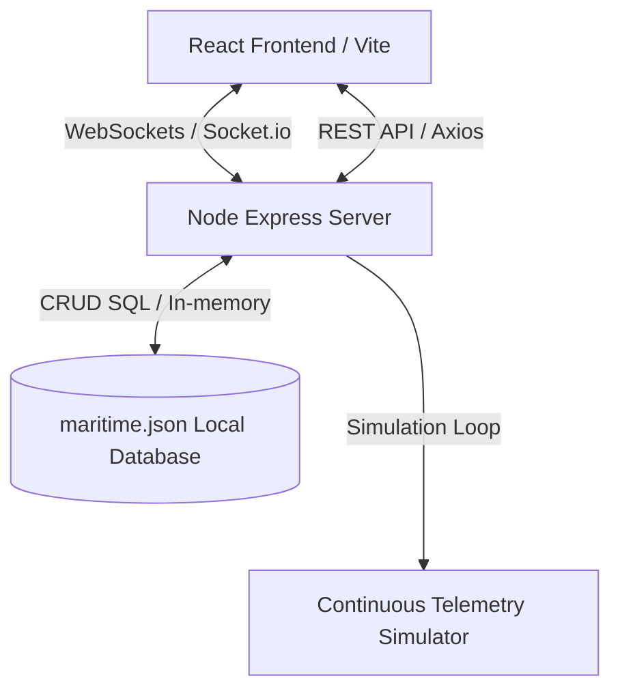

# AQUA-SENTINEL: Secure Maritime Mesh Emergency Responder

**AQUA-SENTINEL** is a production-grade, full-stack maritime emergency response web application designed for operations centers. It integrates evolutionarily optimized telemetry, low-power long-range LoRa mesh topologies, interactive WebGL 3D views, and autonomous drone deployment capabilities to minimize distress responder latency in deep-sea environments.

---

##  Key Features

 3D Real Earth Globe (WebGL)**: Visualizes the global state of the network. Plots active nodes and ships with custom color mappings (Online, Degraded, Alert) and automatic fly-to animation vectors upon distress triggers.
Live Fleet Radar (Leaflet Map)**: A dark-themed map tracking vessels in real-time. Features top-down heading-rotated ship SVGs, historical path trails, and inline controls for tracking or manually dispatching a distress signal.
Autonomous Drone Dispatch & Flight Animation**: Simulates quadcopter dispatch vectors. When a vessel enters a capsize or SOS state, standby drones deploy, rendering a real-time vector canvas overlay calculating flight paths and ETAs.
Canvas 2D Mesh Graph Topology**: Implements a force-directed node graph utilizing 2D canvas particle physics. Simulates real-time telemetry packets traveling between shore gateways, buoy relays, and ships.
Distress Feed & Alert Management**: Responsive layouts with stagger animations. Displays alert columns sorted by severity alongside live donut chart breakdowns and event frequency charts.
Debounced Command Settings**: Interactive command settings debouncing REST PATCH requests directly to backend threshold configs (welfare checks, tilt sensitivity, auto-dispatch, and LoRa frequencies).

---

Technology Stack

### Frontend (Client)
* **Core**: React 18 + Vite + TypeScript
* **Styling**: Tailwind CSS (custom dark operational theme)
* **Animation**: Framer Motion
* **3D Visualizations**: Raw Three.js WebGL rendering
* **Maps**: Leaflet + React Leaflet (Custom SVGs & path polylines)
* **Charts**: Recharts
* **State Management**: Zustand
* **Sockets**: Socket.io Client

### Backend (Server)
* **Core**: Node.js + Express + TypeScript
* **Sockets**: Socket.io
* **Database**: In-memory JSON SQL Simulator (`maritime.json` persistent mock database)
* **Engine**: Continuous simulation loop driving heading drifts, telemetry pings, alerts, and drone flights.

---

##  Architecture



---

##  Local Installation & Setup

### Prerequisites
* [Node.js](https://nodejs.org/) (v18.x or higher)
* [npm](https://www.npmjs.com/)

### Setup Instructions
1. **Clone the repository**:
   ```bash
   git clone https://github.com/Yokesveren/BYTECLUB_Aquasentinel.git
   cd BYTECLUB_Aquasentinel
   ```

2. **Install all dependencies**:
   ```bash
   npm run install:all
   ```

3. **Start the application**:
   ```bash
   npm run dev
   ```
   * **Frontend Dashboard**: `http://localhost:5173`
   * **Backend server API & Sockets**: `http://localhost:3001`

---

## ☁️ Cloud Deployment

### Backend (Render or Railway)
Deploy the `server` directory as a **Web Service**:
* **Root Directory**: `server`
* **Build Command**: `npm install && npm run build`
* **Start Command**: `node dist/index.js`

### Frontend (Vercel)
Deploy the `client` directory as a **Static Web Project**:
* **Framework Preset**: `Vite`
* **Root Directory**: `client`
* **Build Command**: `npm run build`
* **Output Directory**: `dist`
* **Environment Variables**:
  * `VITE_API_URL` = `https://your-backend-api.com/api`
  * `VITE_SOCKET_URL` = `https://your-backend-api.com`
